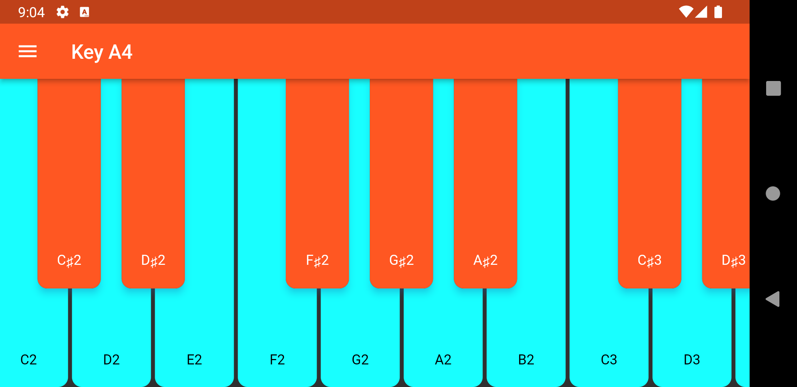

# Simple midi keyboard app with firebase

A Flutter midi piano project powered with [Firebase](https://firebase.google.com/) and inspired by original [RodyDavis - Flutter Piano](https://github.com/rodydavis/flutter_piano/tree/5k).

In this project i added Firebase options to configure concurrently between installed apps such as changing theme, width, and scrolling options.

For example when you installed apps in ios and android, you will change the settings in ios and see the result the another device(s). Some of images seeing below.

## Android



## iOS
 (I spent couple of hours to build because of firebase integration :sweat_smile:)


## Firebase Data
The JSON data you see below, you need to add your "cloudfirestore" collection. Collection name "midi_settings". I added random values.

```json
{
    "allow_note":true,
    "change_theme":true,
    "note":50,
    "offset":50,
    "single_control":1,
    "width":"0.0"
}
```

## Warning!!!
Due to firebase quota limit (free version), you may faced with the data streaming issue.

This project is purely for experimentation and learning the flutter architecture. I hope it interests you. By the way, thank you [Rody Davis](https://github.com/rodydavis).